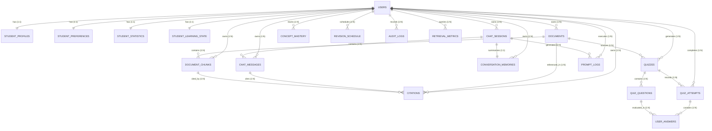

# Enterprise Database Design & Relational Schema Specification
## Adaptive AI Learning Platform

---

## 1. Schema Design Principles
The relational database foundation is engineered using **PostgreSQL 16** and **SQLAlchemy 2.0 Async ORM**:
1. **Primary Key Standard**: All tables use globally unique UUID v4 primary keys (`uuid.UUID`).
2. **Third Normal Form (3NF)**: Schema is normalized to 3NF to prevent update anomalies and data redundancy.
3. **Multi-Tenant User Isolation**: Every student-owned table (`documents`, `document_chunks`, `chat_sessions`, `chat_messages`, `conversation_memories`, `citations`, `concept_mastery`, `quizzes`, `quiz_attempts`, `revision_schedule`, `prompt_logs`, `retrieval_metrics`) explicitly includes an indexed `user_id` foreign key.
4. **Auditability & Soft Deletes**: All tables inherit `TimestampMixin` (`created_at`, `updated_at` in UTC). Core entities (`users`, `documents`, `chat_sessions`, `quizzes`) inherit `SoftDeleteMixin` (`is_deleted`, `deleted_at`).

---

## 2. Entity-Relationship Diagram (ERD)

---

## 3. Database Enhancements Rationale

### 3.1 Embedding Metadata Versioning (`documents` table)
- **Rationale**: When embedding models (e.g. `bge-small-en-v1.5` 384d vs `bge-large-en-v1.5` 1024d) or chunking algorithms change, existing vector indexes become incompatible. Storing `embedding_model_name`, `embedding_dimension`, `chunking_strategy_version`, and `indexed_at` on each document guarantees query compatibility and enables automated re-indexing triggers.

### 3.2 Granular Document Processing States (`documents` table)
- **Rationale**: Replaces binary status with explicit state machine steps: `PENDING` $\rightarrow$ `PARSING` $\rightarrow$ `CHUNKING` $\rightarrow$ `EMBEDDING` $\rightarrow$ `INDEXING` $\rightarrow$ `COMPLETED` (or `FAILED`). Allows real-time progress indicators in the frontend UI.

### 3.3 StudentProfile Split into Sub-Entities
- **Rationale**: Decouples static user profile metadata (`student_profiles`), pedagogical UI options (`student_preferences`), quantitative activity counters (`student_statistics`), and latent IRT ability parameters ($\theta$ in `student_learning_state`). Prevents database lock contention during frequent IRT updates.

### 3.4 Conversation Memory Table (`conversation_memories`)
- **Rationale**: Maintains a rolling summary of chat context windows per session to prevent LLM context window overflow while preserving long-term conversational memory.

### 3.5 Normalized Citations Table (`citations`)
- **Rationale**: Normalizes source attribution by linking `chat_messages` $\rightarrow$ `documents` $\rightarrow$ `document_chunks` with similarity score and snippet text. Enables database-level analytics on most frequently cited study materials.

### 3.6 LLM Registry Table (`llm_registry`)
- **Rationale**: Provides dynamic configuration of open-source LLMs (Qwen 2.5 3B, Llama 3.2 3B), inference provider (`ollama`, `vLLM`), context window length (32k), and hyper-parameters without hardcoding.

### 3.7 Observability & Telemetry Tables (`audit_logs`, `prompt_logs`, `retrieval_metrics`)
- **Audit Logs**: Tracks security operations (login attempts, document upload/deletion).
- **Prompt Logs**: Records exact system prompts, injected context, response text, token counts, and latency for compliance and quality benchmarking.
- **Retrieval Metrics**: Measures vector search latency, candidate recall counts, top rerank scores, and confidence threshold refusals ($\tau < 0.35$).
